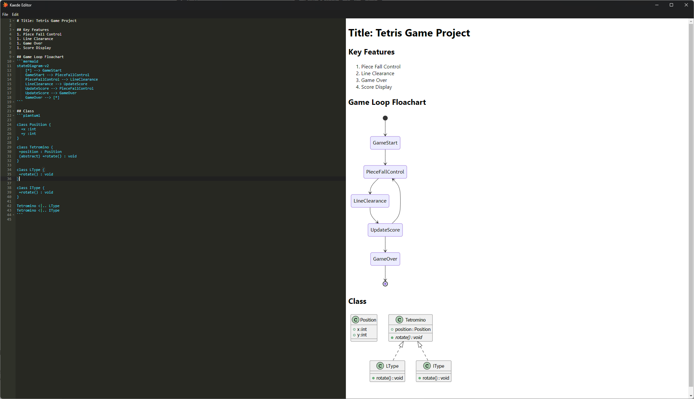

# Kaede Editor

Kaede Editor is a versatile Markdown editor with live preview and diagram support.  
It enables efficient document creation with features like real-time rendering and support for PlantUML and Mermaid.js diagrams.

## Features

Kaede Editor offers a range of powerful features designed to enhance productivity and ease of use:

### File 
- **Open and Save Markdown Files**: Easily manage your work with standard file operations.
- **Export to HTML**: Convert your Markdown documents into HTML format.

### Window 
- **Multi-Window Support**: Open multiple windows to work on several files simultaneously.

### Live Preview
- **Markdown Rendering**: Preview rendered Markdown in real-time.
- **PlantUML Integration**: Embed UML diagrams in your Markdown and visualize them instantly.
- **Mermaid.js Support**: Create and render flowcharts, sequence diagrams, and other diagrams with Mermaid.js.

## Screenshots



## Getting Started

### Prerequisites

Before you begin, ensure you have the following installed:

- **Node.js** (v14 or higher)
- **npm** (v6 or higher)

### Installation

1. Clone the repository:
   ```bash
   git clone https://github.com/username/kaede-editor.git
   ```
2. Navigate to the project directory:
   ```bash
   cd kaede-editor
   ```
3. Install dependencies:
   ```bash
   npm install
   ```
4. Start the application:
   ```bash
   npm start
   ```

## Contributing

We welcome contributions! If you would like to contribute to Kaede Editor, please follow these steps:

1. Fork the repository.
2. Create a new branch for your feature or bug fix:
   ```bash
   git checkout -b feature/your-feature-name
   ```
3. Commit your changes and push to your fork:
   ```bash
   git push origin feature/your-feature-name
   ```
4. Open a pull request and describe your changes.

## Built With

- [Electron](https://www.electronjs.org/) - Framework for building cross-platform desktop apps.
- [React](https://reactjs.org/) - Library for building user interfaces.
- [React-DOM](https://reactjs.org/docs/react-dom.html) - Provides DOM-specific methods for React.
- [Ace-Builds](https://ace.c9.io/) - Embedded code editor.
- [Markdown-it](https://github.com/markdown-it/markdown-it) - Markdown parser and renderer.
- [Mermaid.js](https://mermaid-js.github.io/) - Library for creating diagrams and visualizations.
- [EJS](https://ejs.co/) - Template engine for rendering HTML and data.
- [Electron-Squirrel-Startup](https://github.com/mongodb-js/electron-squirrel-startup) - Simplifies Squirrel startup in Electron apps.

## License

This project is licensed under the MIT License. See the [LICENSE](LICENSE) file for details.
