```mermaid
flowchart LR
    id["This ❤ Unicode"]
```

```mermaid
flowchart TD
    A@{ shape: rounded, label: "This is an event" }
```

```mermaid
flowchart TD
    A@{ shape: stadium, label: "Terminal point" }
```

```mermaid
flowchart TD
    A@{ shape: subproc, label: "This is a subprocess" }
```

```mermaid
flowchart TD
    A@{ shape: cyl, label: "Database" }
```

```mermaid
flowchart TD
    A@{ shape: circle, label: "Start" }
```

```mermaid
flowchart TD
    A@{ shape: odd, label: "Odd shape" }
```

```mermaid
flowchart TD
    A@{ shape: diamond, label: "Decision" }
```

```mermaid
flowchart TD
    A@{ shape: hex, label: "Prepare conditional" }
```

```mermaid
flowchart TD
    A@{ shape: lean-r, label: "Input/Output" }
```

```mermaid
flowchart TD
    A@{ shape: lean-l, label: "Output/Input" }
```

```mermaid
flowchart TD
    A@{ shape: trap-b, label: "Priority action" }
```

```mermaid
flowchart TD
    A@{ shape: trap-t, label: "Manual operation" }
```

```mermaid
flowchart TD
    A@{ shape: dbl-circ, label: "Stop" }
```

```mermaid
flowchart TD
    A@{ shape: text, label: "This is a text block" }
```

```mermaid
flowchart TD
    A@{ shape: notch-rect, label: "Card" }
```

```mermaid
flowchart TD
    A@{ shape: lin-rect, label: "Lined process" }
```

```mermaid
flowchart TD
    A@{ shape: sm-circ, label: "Small start" }
```

```mermaid
flowchart TD
    A@{ shape: framed-circle, label: "Stop" }
```
    
```mermaid
flowchart TD
    A@{ shape: fork, label: "Fork or Join" }
```

```mermaid
flowchart TD
    A@{ shape: hourglass, label: "Collate" }
```

```mermaid
flowchart TD
    A@{ shape: comment, label: "Comment" }
```

```mermaid
flowchart TD
    A@{ shape: brace-r, label: "Comment" }
```

```mermaid
flowchart TD
    A@{ shape: braces, label: "Comment" }
```

```mermaid
flowchart TD
    A@{ shape: bolt, label: "Communication link" }
```

```mermaid
flowchart TD
    A@{ shape: doc, label: "Document" }
```

```mermaid
flowchart TD
    A@{ shape: delay, label: "Delay" }
```

```mermaid
flowchart TD
    A@{ shape: das, label: "Direct access storage" }
```

```mermaid
flowchart TD
    A@{ shape: lin-cyl, label: "Disk storage" }
```

```mermaid
flowchart TD
    A@{ shape: curv-trap, label: "Display" }
```

```mermaid
flowchart TD
    A@{ shape: div-rect, label: "Divided process" }
```

```mermaid
flowchart TD
    A@{ shape: tri, label: "Extract" }
```

```mermaid
flowchart TD
    A@{ shape: win-pane, label: "Internal storage" }
```

```mermaid
flowchart TD
    A@{ shape: f-circ, label: "Junction" }
```

```mermaid
flowchart TD
    A@{ shape: lin-doc, label: "Lined document" }
```

```mermaid
flowchart TD
    A@{ shape: notch-pent, label: "Loop limit" }
```

```mermaid
flowchart TD
    A@{ shape: flip-tri, label: "Manual file" }
```

```mermaid
flowchart TD
    A@{ shape: sl-rect, label: "Manual input" }
```

```mermaid
flowchart TD
    A@{ shape: docs, label: "Multiple documents" }
```

```mermaid
flowchart TD
    A@{ shape: processes, label: "Multiple processes" }
```

```mermaid
flowchart TD
    A@{ shape: flag, label: "Paper tape" }
```

```mermaid
flowchart TD
    A@{ shape: bow-rect, label: "Stored data" }
```

```mermaid
flowchart TD
    A@{ shape: cross-circ, label: "Summary" }
```

```mermaid
flowchart TD
    A@{ shape: tag-doc, label: "Tagged document" }
```

```mermaid
flowchart TD
    A@{ shape: tag-rect, label: "Tagged process" }
```

```mermaid
flowchart TD
    A@{ icon: "fa:user", form: "square", label: "User Icon", pos: "t", h: 60 }
```

```mermaid
flowchart TD
    A@{ img: "https://placehold.jp/3d4070/ffffff/150x150.png", label: "Image Label", pos: "t", w: 150, h: 150, constraint: "off" }
```

```mermaid
flowchart LR
    A-->B
```

```mermaid
flowchart LR
    A --- B
```

```mermaid
flowchart LR
    A-- This is the text! ---B
```

```mermaid
flowchart LR
    A---|This is the text|B
```

```mermaid
flowchart LR
    A-->|text|B
```

```mermaid
flowchart LR
    A-- text -->B
```

```mermaid
flowchart LR
   A-.->B;
```

```mermaid
flowchart LR
   A-. text .-> B
```

```mermaid
flowchart LR
   A ==> B
```

```mermaid
flowchart LR
   A == text ==> B
```

```mermaid
flowchart LR
    A ~~~ B
```

```mermaid
flowchart LR
   A -- text --> B -- text2 --> C
```

```mermaid
flowchart LR
   a --> b & c--> d
```

```mermaid
flowchart TB
    A & B--> C & D
```

```mermaid
flowchart TB
    A --> C
    A --> D
    B --> C
    B --> D
```

```mermaid
flowchart LR
    A --o B
```

```mermaid
flowchart LR
    A --x B
```

```mermaid
flowchart LR
    A o--o B
    B <--> C
    C x--x D
```

```mermaid
flowchart TD
    A[Start] --> B{Is it?}
    B -->|Yes| C[OK]
    C --> D[Rethink]
    D --> B
    B ---->|No| E[End]
```

```mermaid
flowchart TD
    A[Start] --> B{Is it?}
    B -- Yes --> C[OK]
    C --> D[Rethink]
    D --> B
    B -- No ----> E[End]
```

```mermaid
flowchart LR
    id1["This is the (text) in the box"]
```

```mermaid
    flowchart LR
        A["A double quote:#quot;"] --> B["A dec char:#9829;"]
```

```mermaid
flowchart TB
    c1-->a2
    subgraph one
    a1-->a2
    end
    subgraph two
    b1-->b2
    end
    subgraph three
    c1-->c2
    end
```

```mermaid
flowchart TB
    c1-->a2
    subgraph ide1 [one]
    a1-->a2
    end
```

```mermaid
flowchart TB
    c1-->a2
    subgraph one
    a1-->a2
    end
    subgraph two
    b1-->b2
    end
    subgraph three
    c1-->c2
    end
    one --> two
    three --> two
    two --> c2
```

```mermaid
flowchart LR
  subgraph TOP
    direction TB
    subgraph B1
        direction RL
        i1 -->f1
    end
    subgraph B2
        direction BT
        i2 -->f2
    end
  end
  A --> TOP --> B
  B1 --> B2
```

```mermaid
flowchart LR
    subgraph subgraph1
        direction TB
        top1[top] --> bottom1[bottom]
    end
    subgraph subgraph2
        direction TB
        top2[top] --> bottom2[bottom]
    end
    %% ^ These subgraphs are identical, except for the links to them:

    %% Link *to* subgraph1: subgraph1 direction is maintained
    outside --> subgraph1
    %% Link *within* subgraph2:
    %% subgraph2 inherits the direction of the top-level graph (LR)
    outside ---> top2
```

```mermaid
%%{init: {"flowchart": {"htmlLabels": false}} }%%
flowchart LR
subgraph "One"
  a("`The **cat**
  in the hat`") -- "edge label" --> b{{"`The **dog** in the hog`"}}
end
subgraph "`**Two**`"
  c("`The **cat**
  in the hat`") -- "`Bold **edge label**`" --> d("The dog in the hog")
end
```

```mermaid
flowchart LR
    A-->B
    B-->C
    C-->D
    click A callback "Tooltip for a callback"
    click B "https://www.github.com" "This is a tooltip for a link"
    click C call callback() "Tooltip for a callback"
    click D href "https://www.github.com" "This is a tooltip for a link"
```

```mermaid
flowchart LR
    A-->B
    B-->C
    C-->D
    D-->E
    click A "https://www.github.com" _blank
    click B "https://www.github.com" "Open this in a new tab" _blank
    click C href "https://www.github.com" _blank
    click D href "https://www.github.com" "Open this in a new tab" _blank
```

```mermaid
flowchart LR
%% this is a comment A -- text --> B{node}
   A -- text --> B -- text2 --> C
```

```mermaid
flowchart LR
    id1(Start)-->id2(Stop)
    style id1 fill:#f9f,stroke:#333,stroke-width:4px
    style id2 fill:#bbf,stroke:#f66,stroke-width:2px,color:#fff,stroke-dasharray: 5 5
```

```mermaid
flowchart LR
    A:::someclass --> B
    classDef someclass fill:#f96
```

```mermaid
flowchart LR
    A:::foo & B:::bar --> C:::foobar
    classDef foo stroke:#f00
    classDef bar stroke:#0f0
    classDef foobar stroke:#00f
```

```mermaid
flowchart LR
    A-->B[AAA<span>BBB</span>]
    B-->D
    class A cssClass
```

```mermaid
flowchart TD
    B["fa:fa-twitter for peace"]
    B-->C[fa:fa-ban forbidden]
    B-->D(fa:fa-spinner)
    B-->E(A fa:fa-camera-retro perhaps?)
```

```mermaid
flowchart TD
    B["fa:fa-twitter for peace"]
    B-->C["fab:fa-truck-bold a custom icon"]
```

```mermaid
flowchart LR
    A[Hard edge] -->|Link text| B(Round edge)
    B --> C{Decision}
    C -->|One| D[Result one]
    C -->|Two| E[Result two]
```
